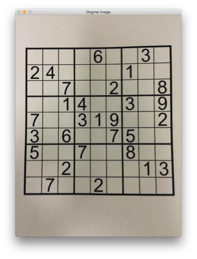
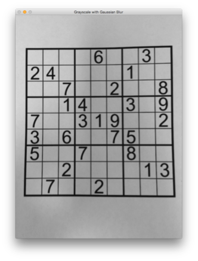
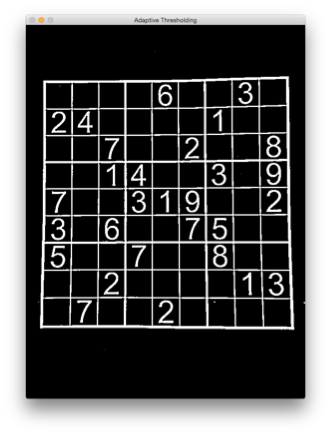
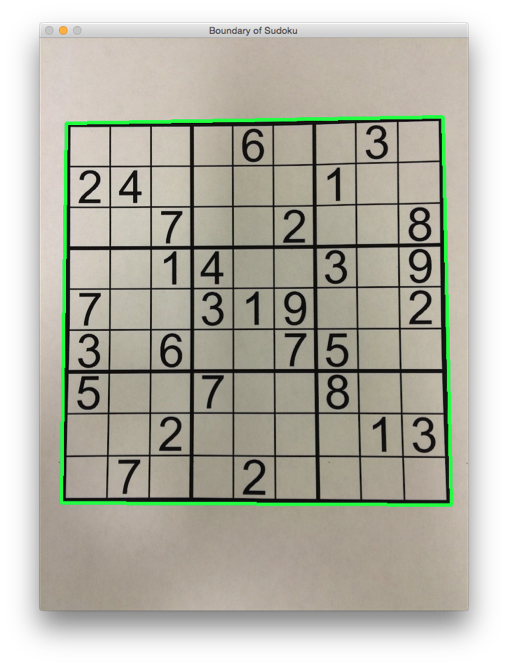
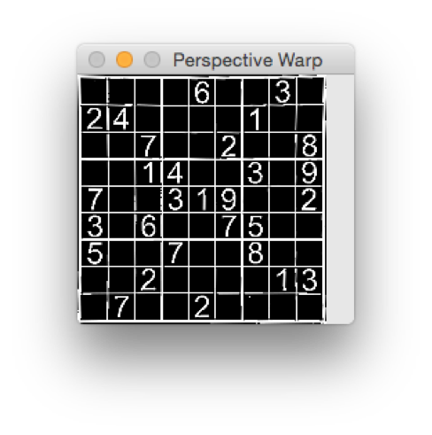
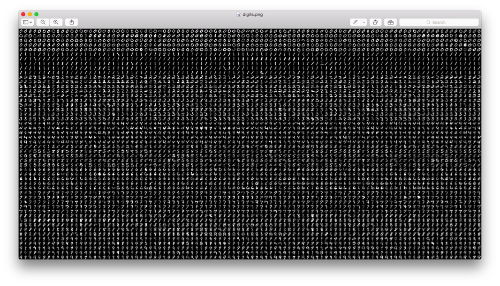
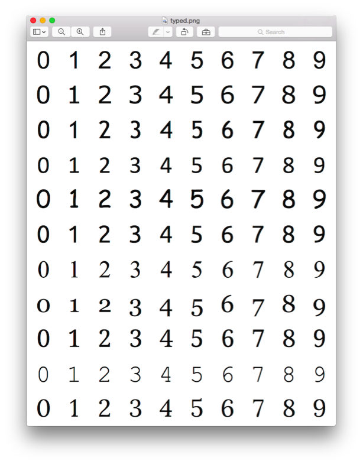
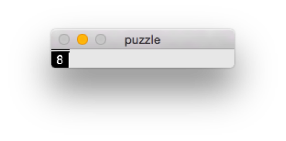
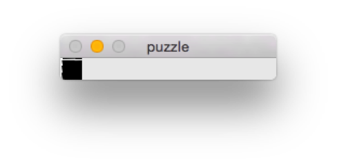
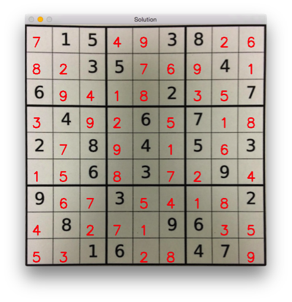

# Vision Based Sudoku Solver
Created by [Sasha McIntosh](@sashamcintosh) & Michael Saltzman
for Visual Interfaces to Computers
on Tuesday, May 12th 2015

## 1. Motivation
Sudoku is a number-puzzle game that has become very popular in recent times and is typically featured in newspapers, magazines, and stand-alone books. The sudoku puzzle consists of a 9x9 square grid. The goal of the puzzle is to fill the grid with numbers from 1-9. Each row and column can only contain one instance of each number. Furthermore, each 3x3 grid within the puzzle can only contain one instance of each number. Typically, some of the numbers are given as a starting point. Fewer starting numbers indicates a higher difficulty. The goal is then to fill in the puzzle, given these constraints.

Sudoku is a number-puzzle that is well known and understood, and widely played. It has a fixed set of rules, inputs and logic making it a reasonable vision and machine learning challenge. For these reasons we chose to construct a system that solves a sudoku puzzle, given an image of the puzzle. Captured as an image in its physical form, sudoku puzzle extraction provides a reasonable set of challenges. Challenges vary based on the physical form and can include glare, shadow, warped bounding lines, blurring and fading.

## 2. Program Input
For this project, we limited the input space significantly to control various factors. We used 4 images to test. Each image was printed on white paper and the sudoku puzzle consists of black ink with common font faces. No handwritten puzzles were used. Each image was captured using an iPhone 5s and the camera was placed directly over the paper to control the rotation and angle of the photo. The room was well-lit to reduce shadowing. Each image was then scaled down by ¼ to reduce the quality for contouring. (higher quality photos generally resulted in worse performance).

## 3. Grid Extraction
### Implementation
First, we preprocess the image. This involves converting the image to grayscale, applying a Gaussian filter to blur the image and remove noise, and finally applying an adaptive threshold to binarize the image. Applying global thresholds did not work in this case as the images did have a bit of shadowing. Global thresholds resulted in very choppy binary images.

```python
img =  cv2.imread(img_name)  
gray = cv2.cvtColor(img,cv2.COLOR_BGR2GRAY)  
gray = cv2.GaussianBlur(gray,(5,5),0)  
thresh = cv2.adaptiveThreshold(gray,255,1,1,11,2)  
```

Original Image | Grayscale with Gaussian Blur | Adaptive Thresholding
---------------|------------------------------|----------------------
 |  | 

Next, we find the contours in the image. For the inputs we have selected, the largest contour is always the bounding rectangle of the entire puzzle. This can be found by finding the contour with the largest area. Once we know where the puzzle is in the image, we can apply a perspective warp to extract the puzzle. This allows us to make sure the puzzle is transformed into a square if it was originally skewed and this also allows us to standardize the input puzzles for the digit recognition step. Specifically, we warp the image into a 180x180 square so that each cell is a 20x20 image.

```python
contours, hierarchy = cv2.findContours(thresh.copy(), cv2.RETR_TREE, cv2.CHAIN_APPROX_SIMPLE)  

contour = None  

# Determine which contour is the largest, aka the actual contour.  
for cnt in contours:  
	moments = cv2.moments(cnt)  
    area = moments['m00']  
    if area > max_area:  
        contour = cnt  
  
peri = cv2.arcLength(contour,True)  ¬¬
  
# approx is the 4 corners of the puzzle  
approx = cv2.approxPolyDP(contour,0.02*peri,True)  
approx = order_corners(approx)  
  
h = np.array([ [0,0],[179,0],[179,179],[0,179] ],np.float32)  
	  
retval = cv2.getPerspectiveTransform(approx,h)  
warp = cv2.warpPerspective(gray,retval,(180,180))  
```

Boundary of Sudoku | Perspective Warp 
---------------|------------------------------|----------------------
 |  

### Performance

For all 4 puzzles, the program is successfully able to locate the grid and extract it with a perspective warp.

## 4. Digit Extraction and Recognition
### Implementation

Once the grid is prepared, we slice up the grid into 80 20x20 cells. Each cell then either contains a number or is blank. Then we can attempt to read a value from this cell. I attempted multiple strategies for digit recognition. The most success I had was with k Nearest Neighbors. I tested for two different training sets, one a handwritten corpus of 5000 digits (above), and the other a typed corpus of 110 digits of different fonts (below). Each image is well-formed so that the digits each take up an equal amount of space (20x20) [2].

For the training step, I took either of these training images, split them up into cells, and vectorized them such that each pixel was one feature. The result was a feature vector of length 400 for each digit cell. Then, I saved these vectors to a model file for later use.

 
 

For each cell in the puzzle, I cleaned up the edges by zeroing out the 1-pixel border to remove any remnants of the grid that may be in the cell. I then vectorize the cell (1x400) and find its k nearest neighbors in the training set in order to determine what number it is. In the case of blanks, I summed over the feature vector and found that most blank spaces had sums << 500 while numbers had sums >> 500. Therefore, I used the sum over the feature vector to label blanks. I tested accuracy over both training sets and values of k and ultimately determined that the best value is k=1 for the handwritten set. This is probably due to the small size of the type-faced set. Here is the data for various k values and over both training sets.

   | img2 (handwritten) | img2 (typed) 
---|---------------|--------------
**k** | **Accuracy** | **Accuracy**
1  | 51.8518518519 | 53.0864197531
2  | 53.0864197531 | 49.3827160494
3  | 53.0864197531 | 49.3827160494
4  | 53.0864197531 | 51.8518518519
5  | 51.8518518519 | 50.6172839506
6  | 51.8518518519 | 50.6172839506
7  | 50.6172839506 | 51.8518518519
8  | 50.6172839506 | 51.8518518519
9  | 49.3827160494 | 51.8518518519
10 | 49.3827160494 | 51.8518518519
11 | 49.3827160494 | 51.8518518519
12 | 50.6172839506 | 51.8518518519
13 | 49.3827160494 | 49.3827160494
14 | 49.3827160494 | 49.3827160494
15 | 49.3827160494 | 50.6172839506
16 | 50.6172839506 | 51.8518518519
17 | 49.3827160494 | 50.6172839506
18 | 49.3827160494 | 50.6172839506
19 | 49.3827160494 | 51.8518518519
20 | 50.6172839506 | 50.6172839506

   | img3 (handwritten) | img3 (typed)
---|---------------|--------------
**k** | **Accuracy** | **Accuracy**
1  | 70.3703703704 | 65.4320987654
2  | 67.9012345679 | 64.1975308642
3  | 66.6666666667 | 64.1975308642
4  | 67.9012345679 | 62.962962963
5  | 66.6666666667 | 65.4320987654
6  | 66.6666666667 | 64.1975308642
7  | 67.9012345679 | 64.1975308642
8  | 66.6666666667 | 64.1975308642
9  | 66.6666666667 | 65.4320987654
10 | 66.6666666667 | 64.1975308642
11 | 66.6666666667 | 64.1975308642
12 | 65.4320987654 | 62.962962963
13 | 65.4320987654 | 62.962962963
14 | 65.4320987654 | 62.962962963
15 | 65.4320987654 | 62.962962963
16 | 65.4320987654 | 62.962962963
17 | 64.1975308642 | 62.962962963
18 | 65.4320987654 | 62.962962963
19 | 64.1975308642 | 62.962962963
20 | 64.1975308642 | 64.1975308642

I attempted other methods using kNN, such as computing the bounding box for each digit and then using those pixels for the vector. Ultimately, these methods did not improve the accuracy. Below is the output of the digit recognition for various 20x20 cells. The labels were: 8, blank; 8, 4

   |   |
---|---|
  | 
 |  

```python
# Now we split the image into 81 cells, each 20x20 size  
cells_thresh = [np.hsplit(row,9) for row in np.vsplit(warp_thresh,9)]  
  
# Make it into a Numpy array. It size will be (9,9,20,20)  
p_thresh = np.array(cells_thresh)  
labels = []  
  
for i in range(9):  
    for j in range(9):  
        contours, hierarchy = cv2.findContours(p_thresh[i,j].copy(), cv2.RETR_TREE, cv2.CHAIN_APPROX_SIMPLE)  
                area = sum(sum(remove_edges(p_thresh[i,j].copy())))  
  
        if (len(contours) == 0) or area < MIN_AREA:  
            label = 0  
            warp_test = p_thresh[i,j]  
        else:  
            contour = contours[0]  
            if cv2.contourArea(contour) < 5.0:  
                approx = np.array([ [0,0],[19,0],[19,19],[0,19] ],np.float32)  
  
            else:  
                x,y,w,h = cv2.boundingRect(contour)  
                approx = np.array([ [y,x],[y+h,x],[y+h,x+w],[y,x+w] ],np.float32)  
  
                new_corners = np.array([ [0,0],[19,0],[19,19],[0,19] ],np.float32)  
  
                retval = cv2.getPerspectiveTransform(approx,new_corners)  
                warp_test = cv2.warpPerspective(p_thresh[i,j],retval,(20,20)) 
                  
                test = p_thresh[i,j].reshape(-1,400).astype(np.float32)  
  
                label = test_number(model,test, k).tolist()[0]  
                label = int(label[0])  
  
            labels.append(label)  
            #print 'Area: {}'.format(area)  
            #print 'Label: {}'.format(label)  
            #show_img('puzzle', p_thresh[i,j]) 
```

### Performance
Digit extraction was typically always successful. This is due to the standardized perspective warp of puzzles that we used in the previous step. However digit recognition prove to be the most difficult part of the pipeline. We ultimately could only establish an accuracy of 40-70% for any given puzzle. As a result, the solver can never work to completion and after this step, we feed the actual puzzle into the solver to complete the pipeline.

## 5. Sudoku Solver
### Implementation
The implementation of the sudoku solver we used was largely influenced by an algorithm presented on the mathworks “Technical Articles and Newsletters” section [5]. We had initially planned for our implementation to mimic that of Norvig [3], however we found the mathworks algorithm to be more intuitive in addition to serving needs of the system well enough.
The sudoku solver takes as input an 81 character string representing the puzzle, as if each row was appended to the previous. Zeros are utilized to represent the blank spaces. The stringToArray function converts the string to a numpy array of integers.

```python
# converts long string input into numpy array  
def stringToArray(puzzle):  
    out = np.zeros((9,9))  
    puzzle = list(puzzle)  
  
    for i in range(0,9):  
        for j in range(0,9):  
            out[i,j] = puzzle.pop(0)  
  
    return out.astype(int)      
  
# provides examples of 2 puzzles  
def example():  
    puzzle = '000060030240000100007002008001400309700319002306007500500700800002000013070020000'  
    puzzle = '507314000240009004164000093805400009000971000900005307280000645400800000000546902'  
    puzzle = stringToArray(puzzle)  
  
    print 'Example Puzzle:'  
    print puzzle  
    print  
    print 'Solved:'  
    print sudoku(puzzle) 
```

The candidates function is called from within the sudoku function and takes as input the current iteration of the puzzle. This function first creates an empty 9x9 list that will contain the possible solution digits for each cell of the sudoku. For each cell that is empty, we begin with all possible digits 0-9 (0 is included to facilitate easy indexing). We check against the row, column and sub-grid and eliminate from our set of possibilities and number that occur in these areas. The remaining candidates are saved in the candidate grid C.

```python
# find the correct upper left corner of cube   
def tri(k):  
    return int( 3*math.floor(k/3) )  
  
# determines the candidate numbers for each   
def candidates(X):  
    C = np.empty((9,9))  
    C.fill(None)  
    C = C.tolist()  
  
    for i in range(0,9):  
        for j in range(0,9):  
  
            if X[i, j] == 0:  
                z = range(0,10) #leading zero will be removed later  
  
                # eliminate possibilities based on row  
                for e in X[ i, np.nonzero(X[i,:])[0] ]:  
                    z[e] = 0  
                # eliminate possibilities based on column  
                for e in X[ np.nonzero(X[:,j])[0], j]:  
                    z[e] = 0  
                # eliminate possibilities based on cube  
                Ti = tri(i)  
                Tj = tri(j)  
                for e0, e1 in np.transpose( np.nonzero(X[ Ti:Ti+3, Tj:Tj+3 ]) ).tolist():  
                    z[ X[Ti+e0][Tj+e1] ] = 0  
  
                C[i][j] = np.nonzero(z)[0].tolist()  
```

Next, we create a lengths array L that is also 9x9 and contains the number of candidates for each unfilled cell. With this array we generate s and e, respectively the first cell with a single candidate and the first cell with no candidates. The candidate array and these 2 values are passed back to the sudoku function.

```python
    # maintain the number of candidates for each cell  
    L = np.zeros((9,9)).astype(int)  
    for i in range(0,9):  
        for j in range(0,9):  
            if type(C[i][j])==list:  
                L[i,j]= len(C[i][j])  
  
    s = np.transpose( np.where((X==0) & (L==1)) )  
    if len(s) > 0:  
        s = s[0]  
    e = np.transpose( np.where((X==0) & (L==0)) )  
    if len(e) > 0:  
        e = e[0]  
  
    return C, s, e  
```

The are four main components to the sudoku function, as noted on the mathworks site:

```python
Fill in all singletons.
Exit if a cell has no candidates.
Fill in a tentative value for an empty cell.
Call the program recursively.
```

The first step is accomplished by the candidates function mentioned above. We call candidates again in the while loop in order to fill in as many singletons as possible before moving forward. We exit on impossible puzzles or recursive calls made on incorrect decisions by checking the e value (which tells us if there are any unfilled cells with no candidates. 

```python
def sudoku(X):  
    # C is a cell array of candidate vectors  
    # s is the first cell, if any, with one candidate.   
    # e is the first cell, if any, with no candidates.   
    C, s, e = candidates(X)  
    while s.size>0 and e.size==0:  
        s0, s1 = s[0], s[1]  
        X[s0][s1] = C[s0][s1][0]  
        C, s, e = candidates(X)  
    # Return for impossible puzzles.   
    if e.size>0:  
        return False  
```

In the backtracking step we check that there are any unfilled cells left, and if so we try and fill the cell with one of its candidate numbers, then recursively call the sudoku function on the test filled array. We operate on a copy of the array in case the trial fails and we must go back to the array before we filled it with our trial candidate. If we find a solution while in this step (none of the cells are empty) we return the solved puzzle. Similarly, if we make it past the outer if statement the puzzle is solved and we return the solved puzzle.

```python
    # Recursive backtracking.   
    if np.any(X==0):  
        Y = X[:,:]  
  
        # The first unfilled cell.  
        z = np.transpose( np.where(X==0) )[0]     
        z0, z1 = z[0], z[1]  
  
        # Iterate over candidates.  
        for r in C[z[0]][z[1]]:           
            X = Y[:,:]  
            # Insert a tentative value.  
            X[z0][z1] = r                 
            # Recursive call.  
            X = sudoku(X.copy())  
            # Found a solution.       
            if np.any(X>0) and not np.any(X==0):       
                return X  
  
    return X  
```

### Performance
The short function below was how we measured our performance speeds. We looked at input files of many sudokus and timed our solver. Unfortunately, many of the test sets we found did not have solution sets to check against. For this reason, we checked accuracy by hand against a smaller set of sudokus.

```python
# test the performance of the algorithm  
def testSpeed(filename):  
    infile = open(filename, 'r')  
  
    test_set = []  
    for line in infile:  
        test_set.append( line.replace('.', '0') )  
    infile.close()  
  
    count = 1  
    for puzzle in test_set:  
        start = time.time()  
        sudoku( stringToArray(puzzle) )  
        end = time.time()  
  
        print 'Puzzle:', count, 'Time:', end - start, 'seconds'  
        count +=1  
  
testSpeed('sudoku_solver_test_easy.txt')  
```

The first test set used to benchmark performance was found at Project Euler [6]. This set of 50 sudoku puzzles were easy to medium in difficulty and the system handled processing them well. In this data set, each solution in computed in about 5 seconds or less (see Appendix A). This performance is not as great as the solution proposed by Norvig [3], but sufficient and effective enough to present a solution to the user in a short amount of time, for most sudokus.

The second test set contained “1011 random (mostly "easy") puzzles” [7]. The results of this test (see Appendix B for the first 80 results) set was more varied, and solve times ranged from less than 0.5 seconds to 20-35 seconds. We found that this time was a big limiting factor (seeing as these are supposed to be easy puzzles), but overall a reasonably good performance.

The last isolated test of the sudoku solver algorithm was for accuracy. For this test, we took the first 10 puzzles from the first test, printed the solution and visually checked that no rules were broken. As an additional sanity check, we printed the sum of all values in the matrix which should always be 405. 

```python
def testAccuracy(filename):  
    infile = open(filename, 'r')  
  
    test_set = []  
    for line in infile:  
        test_set.append( line.replace('.', '0') )  
    infile.close()  
  
    count = 1  
    for puzzle in test_set:  
  
        print 'Puzzle:', count  
        S = sudoku( stringToArray(puzzle) )  
        print S  
        print 'Sum:', np.sum( np.sum(S) )  
  
        count +=1 
```

Output for this function can be found in Appendix C. The solutions were all unique and accurate.

## 5. Output
Once we have a solution, we can superimpose the solution over the image. For more consistency, we superimpose the solution over the puzzle that has been warped to remove skewing. 

```python
for i in range(9):  
    for j in range(9):  
        if puzzle[i, j] == 0:  
            num = str(solution[i,j])  
            org = (j*60+15, (i+1)*60-10)  
            cv2.putText(img, num, org, cv2.FONT_HERSHEY_SIMPLEX, 1, (0,0,255), 2)  
```



## 6. References
1. [Gradient Based Image Edge Detection.](http://www.ijetch.org/vol8/876-ST201.pdf)
2. [OCR of Hand-written Data using kNN in OpenCV (Python).](http://opencv-python-tutroals.readthedocs.org/en/latest/py_tutorials/py_ml/py_knn/py_knn_opencv/py_knn_opencv.html)
3. [Solving Sudokus using Constraint Propagation in Python.](http://norvig.com/sudoku.html)
4. [Using Homography to Superimpose Images in OpenCV (C++).](https://github.com/ramsrigouthamg/codes_public/tree/master/opencv/homography)
5. [Solving Sudoku with MATLAB.](http://www.mathworks.com/company/newsletters/articles/solving-sudoku-with-matlab.html)
6. [Project Euler, Su Doku.](https://projecteuler.net/problem=96)
7. [Warwick, Solving Sudoku puzzles with Python.](http://www2.warwick.ac.uk/fac/sci/moac/people/students/peter_cock/python/sudoku/)

## 7. Appendix
[Appendix A - Sudoku Solver](./Appendix A-Sudoku Solver)

[Appendix B - Sudoku Solver](./Appendix B-Sudoku Solver)

[Appendix C - Sudoku Solver](./Appendix C-Sudoku Solver)


